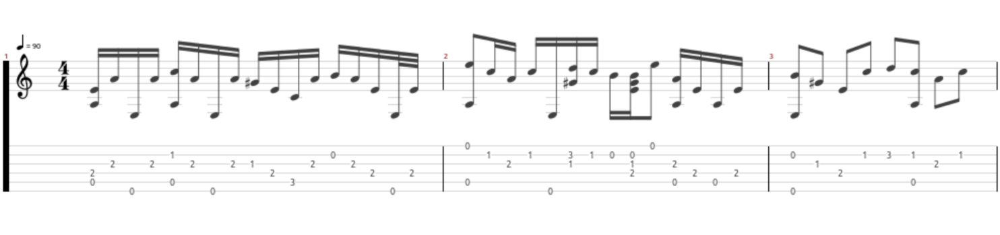
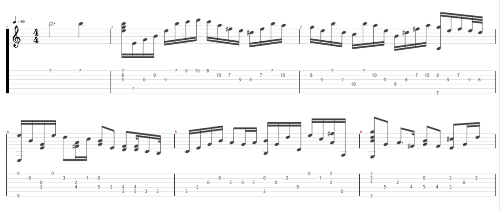

# tab2gp5 — ASCII TAB → Guitar Pro 5 (beta)

> **Beta-Status:** Dieses Tool wandelt **ASCII-TAB** Dateien aus (teils sehr alten) Archiven in **Guitar Pro 5 (.gp5)** um. Der Fokus liegt auf robustem Parsen, adaptiver Quantisierung und einem korrekten GP5-Aufbau (Header → Measure → Track). Es ist als **Startbasis** gedacht, um weitere Verbesserungen vorzunehmen.


## Kernfunktionen
- Liest ASCII-TAB mit typischen Kopf-/Kommentarzeilen und diversen TAB-Mustern (`E|`, `|-`, `E|-`, …).
- Erkennung von Tab-Blöcken (6 Saiten), Taktstrichen `|`, vertikalen Akkorden (mehrstellige Bünde).
- **Adaptive Quantisierung** (z. B. 16→32→64) und optional **feste Taktart** per Argument.
- **Erste Note im Takt**: kleiner Vorlaufabstand wird **nicht als Pause** interpretiert.
- Fehlertoleranz bei unplausiblen Saiten-/Bundwerten (wird übersprungen statt abgebrochen).
- Export als **.gp5** über [pyguitarpro](https://pypi.org/project/pyguitarpro/).

> Hinweis: Die Erkennung/Quantisierung ist heuristisch und noch nicht in allen Randfällen perfekt (Beta).

## Installation
```bash
# Voraussetzung für GP5-Export
pip install pyguitarpro
```

## Aufruf & Parameter

```bash
python txt2gp5.py INPUT.txt [OUTPUT.gp5] [Optionen]
```

**Optionen (Auszug):**
- `--title "Songtitel"` — Titel im GP5.
- `--author "Autor/Artist"` — Artist/Autor im GP5.
- `--tempo 120` — BPM (Standard 120).
- `--tab-spacing 2` — Anzahl Spalten am Taktanfang, die **keine** Pause bedeuten (Vorlauf).
- `--bases 16,32,64` — Quantisierungsbasen (für die Auto-Auflösung je Takt).
- `--fret-max 24` — maximale Bundnummer (Fehlertoleranz).
- `--dry-run` — nur Parsen & Quantisierung zeigen (kein GP5-Schreiben).
- `--meter N/D` — **feste Taktart** für alle Takte (z. B. `3/4`, `5/4`, `6/8`). Der Nenner wird intern als `gp.models.Duration(D)` gesetzt.

**Beispiele:**
```bash
# 1) Standard-Export mit Titel/Autor
python txt2gp5.py test/take_five.txt out.gp5   --title "Take Five (Archiv)" --author "Archiv" --tempo 170 --tab-spacing 2

# 2) Feste Taktart (z. B. 5/4 für Take Five)
python txt2gp5.py test/take_five.txt out.gp5 --meter 5/4

# 3) Nur Testlauf (kein GP5), Quantisierung/Taktgrenzen prüfen
python txt2gp5.py test/andere_datei.txt --dry-run --bases 16,32
```

## Tests & Qualität
- **Gesamte ClassLab‑Library gescannt:** > **2 000** Dateien wurden durchlaufen; bei **< 20** kam es zu Fehlern (z. B. exotische Kodierung/Format).
- **Stichproben in TuxGuitar geprüft:** ausgewählte konvertierte Dateien wurden in **TuxGuitar** geöffnet und **als Hörbeispiel abgespielt** — Timing & Taktung sind bei diesen Beispielen plausibel.
- Bekannte Grenzen: Freiform-TABs ohne klare Balken/Striche, Mischformate oder manuell „verschobene“ Ziffern können die Heuristiken aushebeln (Beta).

## Beispiele (Ordner `test/` im Repo)
Im Repo **tab2gp5** liegt unter [`test/`](https://github.com/woody6402/tab2gp5/tree/main/test) Beispielmaterial:
- **2× TAB** (`*.txt`) — z. B. `test/take_five.txt` u. a.
- **3× PNG** — Screenshots/Visuals als Referenz.

In der README werden die Assets nicht direkt eingebunden, damit das Projekt sauber bleibt, aber du kannst im Repo die Bilder referenzieren, z. B.:

### Brahms

### Buxtehude

### Brubeck


## Hinweise zur Verwendung
- Für Drop‑D oder alternative Tunings gibt es Erkennung/Heuristiken (z. B. `D|` als unterste Saite). Bei Bedarf im Code die gewünschte Stimmung setzen.
- Für sehr ungleichmäßige Spaltenabstände im Takt helfen `--tab-spacing` sowie `--bases` bzw. `--meter` (fixe Taktart).
- Tab Anfang prüfen und gegebenfalls adaptieren.

## Roadmap / Beiträge willkommen
- Erweiterte Symbolik (Hammer‑Ons/Pull‑Offs, Slides, Palm‑Mute, etc.).

> Dieses Tool ist im **Beta‑Stadium** und als **Startbasis** gedacht. Pull‑Requests, Issues und Testdaten willkommen!

---

© 2025 – tab2gp5 (ASCII TAB → GP5)
