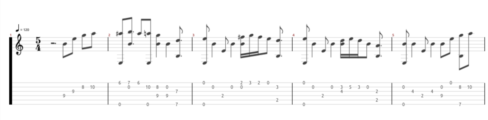

# tab2gp5 — ASCII TAB → Guitar Pro 5 (beta)

**Beta status:** This tool converts **ASCII TAB** files from (sometimes very old) archives into **Guitar Pro 5 (.gp5)**. The focus is on robust parsing, adaptive quantisation and a correct GP5 structure (header → measure → track). It is intended as a **starting point** for further improvements.

Beware that's a helper, some adaptions of the text tab in cases where the score results in nonsens may help.

## Core functions
- Reads ASCII TAB with typical header/comment lines and various TAB patterns (`E|`, `|-`, `E|-`, ...).
- Recognition of tab blocks (6 strings), bar lines `|`, vertical chords (multi-digit frets).
- **Adaptive quantisation** (e.g. 16→32→64) and optional **fixed time signature** via argument.
- **First note in the bar**: small lead-in distance is **not interpreted as a rest**.
- Error tolerance for implausible string/fret values (skipped instead of aborted).
- Export as **.gp5** via [pyguitarpro](https://pypi.org/project/pyguitarpro/).

> Note: Recognition/quantisation is heuristic and not yet perfect in all edge cases (beta).

## Installation
```bash
# Prerequisite for GP5 export
pip install pyguitarpro
```

## Call & Parameters

```bash
python txt2gp5.py INPUT.txt [OUTPUT.gp5] [options]
```

**Options (excerpt):**
- `--title ‘Song title’` — Title in GP5.
- `--author ‘Author/Artist’` — Artist/author in GP5.
- `--tempo 120` — BPM (default 120).
- `--tab-spacing 2` — Number of columns at the beginning of the bar that do **not** indicate a pause (lead-in).
- `--bases 16,32,64` — Quantisation bases (for auto-resolution per bar).
- `--fret-max 24` — Maximum fret number (error tolerance).
- `--dry-run` — show parsing & quantisation only (no GP5 writing).
- `--meter N/D` — **fixed time signature** for all bars (e.g. `3/4`, `5/4`, `6/8`). The denominator is set internally as `gp.models.Duration(D)`.

**Examples:**
```bash
# 1) Standard-Export with title/author
python txt2gp5.py test/take_five.txt out.gp5   --title "Take Five (Archiv)" --author "Archiv" --tempo 170 --tab-spacing 2

# 2) Fixed meter (i.e. 5/4 für Take Five)
python txt2gp5.py test/take_five.txt out.gp5 --meter 5/4

# 3) Only testing (no GP5), quantization and tmeasure borders
python txt2gp5.py test/andere_datei.txt --dry-run --bases 16,32
```

## Tests & Quality
- **Entire ClassLab library scanned:** > **2,000** files were processed; **< 20** errors occurred (e.g. exotic encoding/format).
- **Random samples checked in TuxGuitar:** selected converted files were opened in **TuxGuitar** and **played back as audio samples** — timing and metronome are plausible in these examples.
- Known limitations: Free-form TABs without clear bars/sticks, mixed formats or manually ‘shifted’ numbers can override the heuristics (beta).

## Examples (folder `test/` in the repo)
The repo **tab2gp5** contains sample material under [`test/`](https://github.com/woody6402/tab2gp5/tree/main/test):
- **2× TAB** (`*.txt`) and the generated gp5 files 

### Brahms

### Buxtehude

### Brubeck


## Notes on usage
- For drop D or alternative tunings, there are detection/heuristics (e.g. `D|` as the lowest string). If necessary, set the desired tuning in the code.
- For very uneven column spacing in the bar, `--tab-spacing` and `--bases` or `--meter` (fixed time signature) help.
- Check the beginning of the tab and adapt it if necessary.

- Sometimes parsing is disturbed by uncommon pattern, if so, visual cleaning the text tab may help a lot  ...

## Roadmap / Contributions welcome
- Extended symbols (hammer-ons/pull-offs, slides, palm mutes, etc.).

This tool is in **beta** and intended as a **starting point**. Pull requests, issues and test data are welcome!

## Experiences

- Several runs on my private copy of the classtab archive. 3040 files written, 40 fails.
  - quality depends on the written TAB notation
  - sometimes additional text/chars can lead to wrong recognized tab lines => if eliminated out of the ascii tab file can normally be parsed
  - good results were achieved for example with:
    - Mozart: Kleine Nachtmusik
- Did some trials on ultimate guitar tabs. experiences are similiar.  

---

© 2025 – tab2gp5 (ASCII TAB → GP5)
